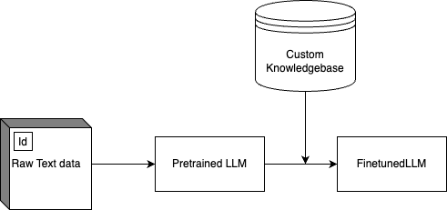

# Finetune Lecture

Torchtune Desiderata:

- Simplicity and Extensibility
- Correctness
- Stability
- Democratizing LLM Fine-tuning (Work out of the box on different hardware)

The competition basically limit the size of LLM that could be used. With this architectural compromise (max 40 GB of VRAM) the current model parameters that are to be considered would be **7B** series.

> Bigger models tend to perform better
