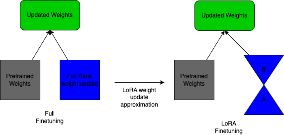
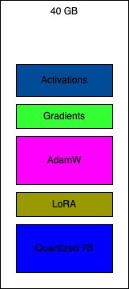

# Finetune Lecture


Torchtune Desiderata:

- Simplicity and Extensibility
- Correctness
- Stability
- Democratizing LLM Fine-tuning (Work out of the box on different hardware)

The competition basically limit the size of LLM that could be used. With this architectural compromise (max 40 GB of VRAM) the current model parameters that are to be considered at maximum consideration would be **7B** series.


> Bigger models tend to perform better

Some takeaways:

- Activation Checkpointing -> Instead of keeping the tensors needed for backward alive until they are used in gradient computation during backward forward computation in checkpointed regions, omits saving tensors for backward and recomputes them during the backward pass. (e.g Batch size with activation checkpointing).

```yaml
batch_size: 4
enable_activation_checkpointing: True
```

- Change the paradigm completely, do LoRA instead of fully finetuned models.



```yaml
model:
    _component_: torchtune.models.llama2.lora_llama2_7b
    lora_attn_modules: ['q_proj', 'v_proj']
    apply_lora_to_mlp: False
    apply_lora_to_output: True
    lora_rank: 8
    lora_alpha: 16
```



> What's the biggest Model we can possibly train with 40 GB?

- Quantize base
- 4 Bit AdamW
- Activation Checkpointing
- BS = 1 with gradient acc

Most likely the less 20B models, just keep swimming

Tools to slay OOM:

- Smaller models
- Quantized optimizer
- Checkpoint activations
- Simulated global BS with gradient accumulation
- LoRA/QLoRA

## RLHF

1. Supervised Fine Tuning
Collect human demonstration data -> Supervised fine tune from Base LLM to SFT model.

2. Training a reward model
Collect human preference data -> Supervised fine tune from Base LLM to Reward Model.

3. Optimize policy
ex PPO: Prompt + Reward -> Policy -> Answer -> Reward Model -> Reward

## MISC

Compile/Kernels
Sample Packing
