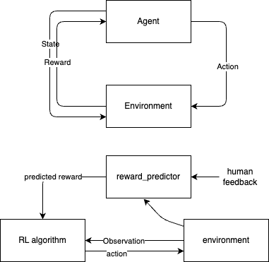
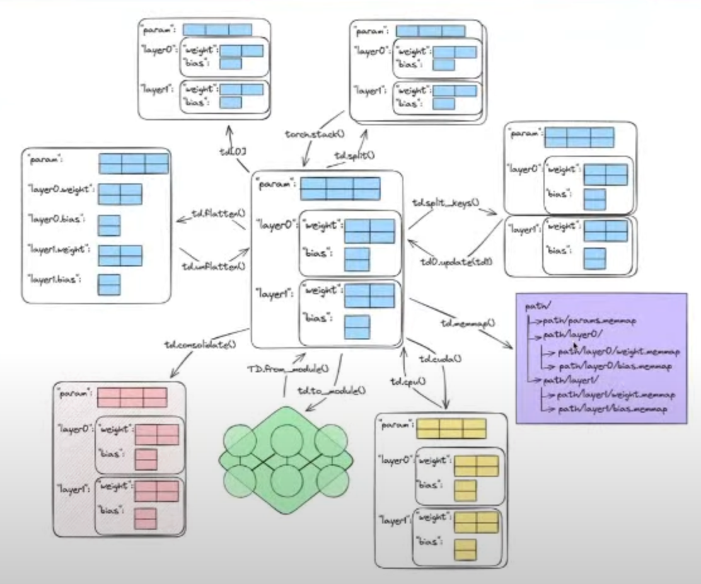

# RLHF (Reinforcement Learning with Human Feedback)

Training LLM on static data causes the model to be misaligned (Poor out of distribution performance), models need to be helpful-honest-harmless is hard to code as well. The solution is using human feedback (accept/reject, ranking) to tell the model when it's wrong.

Pros:

- RL is useful when objective is hard to formulate
- RL is versatile
- Continuous improvement
- Computationally efficient

Cons:

- RL training is less obvious than SL
- RL is an incomplete patch to problems like hallucinations etc.

## RLHF Step-by-step

3 components:

- Large Language Model
- Extra data with qualitative marks (accepted/rejected, ranking)
- Reward model that maps a text to a scalar value

3 phases:

- Train generative model to generate prompts
- Train reward model to triage good and bad data
- Retrain the generative model with PPO(RL) to produce rewarded data with frozen reward model.

Key terms:

- Reward model, a language model to outputs a scalar value of any input
- PPO, on-policy RL algorithm, robust and sample-efficient

## RLHF state of OSS repos

Existing RLHF solutions:

- single high level entry point (trainner)
- if problem firts prereqs: great to quickly train and deploy a solution
- Hard to fit to new problems

TorchRL & RLHF:

- Low level primitives
- Ecosystem for experimenting is easy

## RLHF Data presentation

TensorDict:

- Dictionary-like and tensor-like class
- tensor operations: indexing, stacking, device handling, distributed communication
- key data-structure powering all of TorchRL
- Focus on composability and speed
  - torch.compile compatible
  - fast gpu transfer
  - fused cuda kernels
  - cached operations(eager)

**Tensordict for data representation**

- Seamless torage manipulation
- In RLHF allows to represent data efficiently in a standard way across modalities and training steps

**Tensordict for parameter serialization**

- parameter representation that mirrors the model structure (not flat as state dicts)
- Easily store on disk (memory mapped tensors)
- Easily stacked for batched execution through vmap (mixture of experts etc)
- in RLHF permits to batch models using vmap (eg: reward model and actor), serialize parameters between two phases of training load and save partial models with little effort.

**Tensordict for model execution**

- Programmable composable model construction/execution (module and sequential)
- Build complex models with key-based data flow: automatic sub-graphs constructions through input/output selection.
- In RLHF: permits programmable model manipulation such as select a module based on input/output signature (critic head), reuse part of a module in another reward model.

