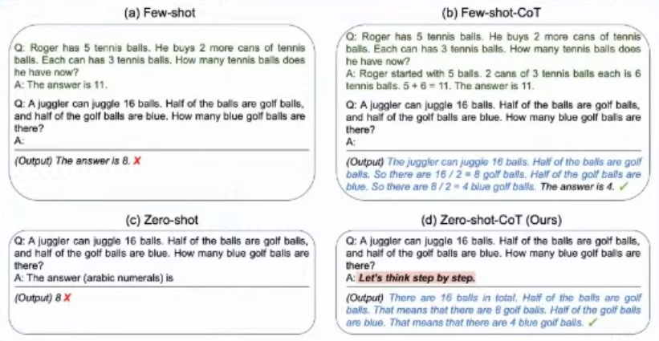

# Multi Agent

Single agent is a back-and-forth chat with a single AI model that is equipped with some tools like external API calls or a python interpreter. Meanwhile Multi-agent is built by several agnets with different metaprompts and uniquee tools. Multi-agent let the agents chat with each other before responding with the user. The idea here is to give a better context for the agent and let them to give feedback by themselves before returning its output to the user.

## Multi Agent Framework benefits

Modularity, it simplifies development and testing which aslo could add capabilities wihtout needing to rebuild everything while also increases interpretability in case the system misbehaves.

Specialization, make the team with mix of experts (each with its own metaprompt and tools) which naturally suited to problems that can be split into clear subtasks.

Collaboration, Allows for critique of intermediate results by other agents. It could get a creative solutions by combining insights that a single agent could miss. Especially useful when the problem is complex enough that it lies beyond the capabilities of any single agent.

Multi agent framework from single Base Model have some considerations, like could you just devise a very clever metaprompt to skip this multi agent settings? There are several reasons about this. Such as Architectural Considerations, Power of iteration/recursion and Prompt sensitivity.

Mixture of Experts, many popular open source LLMs are MoE. Single completion only passes through one of the many experts that make up the LLM.

Iteration/Recursion to the rescue. Reasons to believe that we use slower iterative reasonoing to solve challenging cognitive tasks. Recursive calls to neural networks are provably turing universal.


Prompt sensitivity, LLM are very sensitive to small changes in prompts, this means that combining multiple agents into one is very unstable. We can also run different agents at different temperatures.



Does the multi agent frameworks actually work? There are several case study like from Unity that they could informs the Unity Scene to program their assets directly.

## Building and Running Docker Image

Add a file named `.env` inside `/autogen` folder with at a minimum the following content:

```bash
OAI_API_KEY=<oai_api_key> 
OAI_ORGANIZATION=<oai_org>
OAI_MODEL=<oai_model>  # *optional* (default gpt-4o) 
OAI_BASE_URL=<oia_url> # *optional* 
OAI_API_VERSION=<oia_version> # *optional*
OAI_API_TYPE=<oai_type> # *optional* (default "openai")

VISION_OAI_MODEL=<oai_model> #*optional* (default gpt-4o) 
VISION_OAI_ORGANIZATION=<oai_org> # *optional* 
VISION_OAI_API_KEY=<oai_api_key> # *optional* 
VISION_OAI_BASE_URL=<oia_url> #* optional
VISION_OAI_API_VERSION=<oia_version> # *optional*
VISION_OAI_API_TYPE=<oai_type> # *optional* (default "openai")
```

Image agent (vision capability) is enabled if `VISION_OAI_API_KEY` is provided.

see [LLM Config](https://microsoft.github.io/autogen/docs/topics/llm_configuration/) for more info.

Running a py script  will throw an error without required envs. Check [Config](./app/config/config.py) for more configuration options.

In the root folder run the following to build

```bash
docker build -f ./Dockerfile -t autogen_dev_img .
```

*Note: Once the image is built, no need to rebuild image unless changes are made to `Dockerfile`*

After image is built, run the docker image with either simple or complex example. Running the sample HackerRank data :

```bash
docker run --env-file ./.env  -it -v "$(pwd)/app:/home/autogen/autogen/app" -v "$(pwd)/../assets/practice:/home/autogen/autogen/app/assets" autogen_dev_img:latest python /home/autogen/autogen/app/hackercup.py /home/autogen/autogen/app/assets/
```

- The simple example using multiple agents in a coding scenario, which is a good place to start with AutoGen and coding agents:

`docker run --env-file ./.env  -it -v "$(pwd)/app:/home/autogen/autogen/app" autogen_dev_img:latest python /home/autogen/autogen/app/simple.py`

- A more complex agent is defined in `groupchat_agents.py`

More info on Docker installation with AutoGen:  <https://microsoft.github.io/autogen/docs/installation/Docker/>

## Data Ingest

Example data is located in [/assets](../assets/) and contain two 2023 HackerRank Problems:

- [Cheeseburger Corollary 1](https://www.facebook.com/codingcompetitions/hacker-cup/2023/practice-round/problems/A1)
- [Cheeseburger Corollary 2](https://www.facebook.com/codingcompetitions/hacker-cup/2023/practice-round/problems/A2)
- [DimSum Delivery](https://www.facebook.com/codingcompetitions/hacker-cup/2023/practice-round/problems/B)
- [Two Apples a Day](https://www.facebook.com/codingcompetitions/hacker-cup/2023/practice-round/problems/C)
- [Road To Nutella](https://www.facebook.com/codingcompetitions/hacker-cup/2023/practice-round/problems/D)

The current implementation will solve Cheeseburger Corollary 1 but may fail on harder problems.
For each problem, you'll find these files:

- `<problem_name>.md`: The problem statement formatted in Markdown
- `<problem_name>.in`: The full input file
- `<problem_name>.out`: The full output file
  - Note that some problems accept multiple possible outputs, in which case the full output file is simply an example of an output that would be accepted
- `<problem_name>_sample_input.txt`: The sample input provided by the problem statement
- `<problem_name>_sample_output.txt`: The sample output provided by the problem statement

For full dataset, please visit the [Hackercup HuggingFace dataset](https://huggingface.co/datasets/hackercupai/hackercup)

## Agent Flow

The sequence of agents are as followed:

- Program manager
  - initiates and manages conversations
- Image explainer
  - creates captions for any images in the problem
- Group Manager
  - Problem analyst: define the objective and scope problem
  - Solution architect: create feasible solution
  - Logic critic: verify solution created by Solution architect
  - Coder: implement solution with code
  - Code critic: examines solution, note this does not check outputs currently

## Output

Creates `<problem_id>_generated_code.txt` which will takes input filepath and typically generates and file outputs. These outputs can later be validated.

For the competition, only inputs will be provided.

### Responsible AI

This code is built on top of the [AutoGen](https://github.com/microsoft/autogen) library and inherits the same capabilities and limitations as AutoGen. For more information, please check out AutoGen's [TRANSPARENCY_FAQS](https://github.com/microsoft/autogen/blob/main/TRANSPARENCY_FAQS.md)
