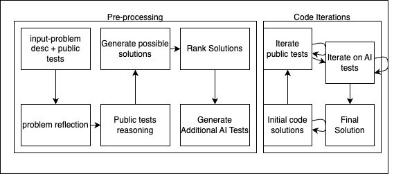
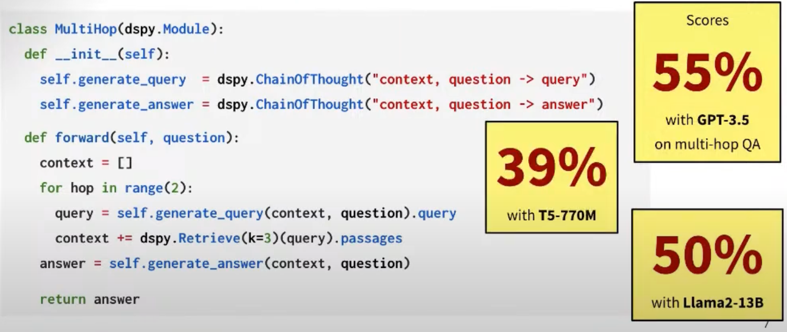
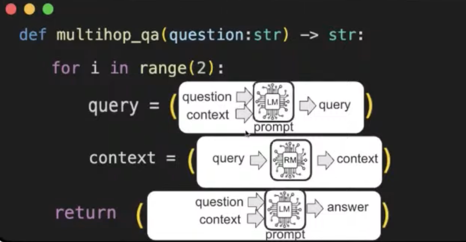

# DSPy

Code Generation, it's been around like 1.5 years relative to Sept 2024. LM systems with multiple modules are advancing tasks.

Pipelines are highly modular in principle. But in practice, they often involve extensive manual prompt engineering. Some project are known on getting 50+ files containing different prompt variations. This is brittle approach by this talk, not effective way.

By DSPy, instead of tweaking prompt, write a short LM program in Python and let the program learn how to use the LM effectively.

## How DSPy makes this possible?

- Separate the program logic from how LMs are being taught to perform steps.
- Automatically optimize how LMs are prompted or finetuned for each step.

## Anatomy of a LM program in DSPy

Key Abstractions: modules, signautures & optimizers.
